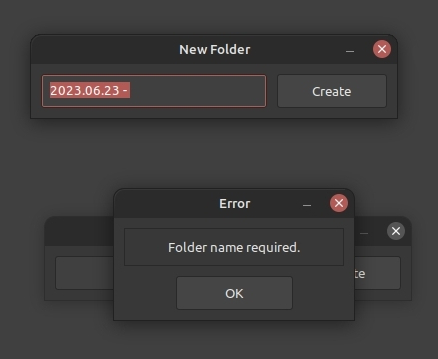

### Description

Simple but pleasant GUI providing a means to create a new folder with the date prepended, in the format 'YYYY.MM.DD - '



Written to help a user on the Linux Mint support forums. You can get more information over on [this](https://forums.linuxmint.com/viewtopic.php?t=398651) thread.

### Installation

```
wget -qO - https://github.com/terminalforlife/PythonProjects/raw/master/source/nemo-scripts/new-dir-date/install.sh | bash -
```

Python >= 3.6 required. GTK libraries required. If you're on Linux Mint, you should already have everything you need. I'd be more helpful marking dependencies, but I'm not yet quite sure _what_ is required for GTK in Python, as I'm fairy new to GUI development.
